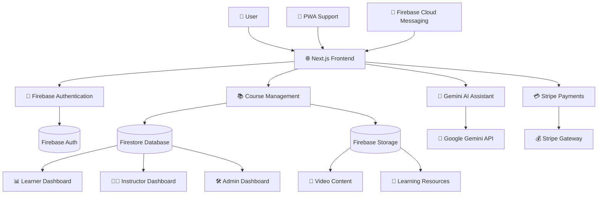

# 🎓 AI Learning Platform

<div align="center">


### 🚀 Next-Generation AI Powered Learning Management System

**An intelligent, scalable, and interactive learning platform built with Next.js, Firebase, TypeScript, Tailwind CSS, and Google Gemini AI.**


</div>

---

# 🌟 Overview

AI Learning Platform is a modern AI-powered Learning Management System (LMS) designed to deliver a personalized and engaging educational experience.

Built using **Next.js, TypeScript, Firebase, Tailwind CSS, Stripe, and Google Gemini AI**, the platform combines intelligent tutoring, course management, progress tracking, and gamification into a single ecosystem.

Students can access courses, interact with an AI tutor, track learning progress, earn achievements, and receive personalized recommendations. Instructors can manage content and monitor student performance, while administrators gain complete control over platform operations.

---

# ✨ Features

## 🤖 AI Learning Assistant
- Gemini AI powered tutoring
- Real-time doubt solving
- Personalized recommendations
- Context-aware responses
- Smart learning guidance

## 👨‍🎓 Learner Dashboard
- Course enrollment
- Progress tracking
- Learning analytics
- Certificates & achievements
- Personalized learning journey

## 👨‍🏫 Instructor Dashboard
- Course creation
- Video uploads
- Student monitoring
- Analytics dashboard
- Content management

## 🛠️ Admin Dashboard
- User management
- Course moderation
- Revenue tracking
- Platform analytics

## 🎥 Interactive Learning
- Video-based learning
- Resource management
- Course categorization
- Resume learning support

## 🏆 Gamification
- XP system
- Achievement badges
- Certificates
- Learning streaks
- Leaderboards

## 💳 Stripe Integration
- Secure payments
- Premium course access
- Subscription support

## 📱 Progressive Web App
- Mobile friendly
- Offline support
- Installable application
- Fast loading experience

---

# 🏗️ System Architecture



---

# 🔄 Application Workflow

## User Authentication

```text
User Login
    │
    ▼
Firebase Authentication
    │
    ▼
Role Verification
    │
    ▼
Dashboard Access
```

### Supported Roles
- 👨‍🎓 Learner
- 👨‍🏫 Instructor
- 🛠️ Admin

---

## AI Learning Workflow

```text
Student Question
       │
       ▼
Gemini AI
       │
       ▼
Context Analysis
       │
       ▼
Smart Response
```

---

## Course Workflow

```text
Instructor
     │
     ▼
Create Course
     │
     ▼
Upload Videos
     │
     ▼
Firebase Storage
     │
     ▼
Student Access
```

---

## Payment Workflow

```text
Course Purchase
       │
       ▼
Stripe Checkout
       │
       ▼
Payment Success
       │
       ▼
Course Enrollment
```

---

# 📂 Project Structure

```bash
AI-Learning-Platform/
│
├── app/
│   ├── dashboard/
│   ├── courses/
│   ├── ai-assistant/
│   ├── instructor/
│   ├── admin/
│   └── auth/
│
├── components/
│   ├── ui/
│   ├── dashboard/
│   ├── courses/
│   └── ai/
│
├── hooks/
│
├── lib/
│   ├── firebase.ts
│   ├── gemini.ts
│   ├── stripe.ts
│   └── auth.ts
│
├── services/
├── public/
├── styles/
├── .env.local
├── package.json
└── README.md
```

---

# 🛠️ Tech Stack

| Category | Technology |
|-----------|------------|
| Frontend | Next.js |
| Language | TypeScript |
| Styling | Tailwind CSS |
| Authentication | Firebase Auth |
| Database | Firestore |
| Storage | Firebase Storage |
| AI | Google Gemini |
| Payments | Stripe |
| Notifications | Firebase Cloud Messaging |
| Deployment | Vercel |
| PWA | Service Workers |

---

# 🚀 Getting Started

## Prerequisites

- Node.js 18+
- Firebase Project
- Gemini API Key
- Stripe Account

---

## Clone Repository

```bash
git clone https://github.com/udayrastogi0531/AI-Learning-Platform.git
cd AI-Learning-Platform
```

---

## Install Dependencies

```bash
npm install
```

---

## Environment Variables

Create a `.env.local` file:

```env
NEXT_PUBLIC_FIREBASE_API_KEY=your_key
NEXT_PUBLIC_FIREBASE_AUTH_DOMAIN=your_domain
NEXT_PUBLIC_FIREBASE_PROJECT_ID=your_project_id
NEXT_PUBLIC_FIREBASE_STORAGE_BUCKET=your_bucket
NEXT_PUBLIC_FIREBASE_MESSAGING_SENDER_ID=your_sender_id
NEXT_PUBLIC_FIREBASE_APP_ID=your_app_id

GEMINI_API_KEY=your_gemini_api_key

STRIPE_SECRET_KEY=your_stripe_secret_key
NEXT_PUBLIC_STRIPE_PUBLISHABLE_KEY=your_publishable_key
```

---

## Run Development Server

```bash
npm run dev
```

Visit:

```text
http://localhost:3000
```

---

# ☁️ Deployment

### Deploy on Vercel

```bash
npm run build
```

Push your code to GitHub and connect the repository with Vercel.

Add all environment variables inside:

```text
Vercel Dashboard → Project Settings → Environment Variables
```

Deploy 🚀

---

# 🎯 Core Modules

### 👨‍🎓 Learner Dashboard
- Learning Progress
- AI Tutor
- Certificates
- Course Enrollment
- Analytics

### 👨‍🏫 Instructor Dashboard
- Course Management
- Student Analytics
- Video Uploads

### 🛠️ Admin Dashboard
- User Management
- Revenue Analytics
- Platform Monitoring

### 🤖 AI Tutor
- Personalized Learning
- Concept Explanations
- Study Recommendations
- Real-Time Q&A

---

# 🚀 Future Enhancements

- AI Generated Quizzes
- AI Study Planner
- Voice-Based Tutor
- Live Classes
- Discussion Forums
- Multi-Language Support
- Mobile App
- Advanced Analytics
- AI Interview Preparation

---

# 🤝 Contributing

Contributions are welcome!

```bash
git checkout -b feature/new-feature
git commit -m "Add new feature"
git push origin feature/new-feature
```

Open a Pull Request 🚀

---

# 📄 License

This project is licensed under the MIT License.

---

# 👨‍💻 Author

**Uday Rastogi**

GitHub: https://github.com/udayrastogi0531

Built with ❤️ using Next.js, Firebase, TypeScript, Tailwind CSS, Stripe, and Google Gemini AI.

---

<div align="center">

### ⭐ If you like this project, don't forget to star the repository!

🚀 Empowering the Future of Education with AI

</div>
